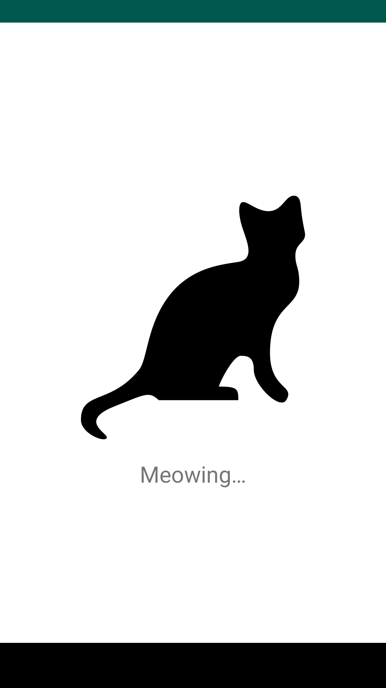
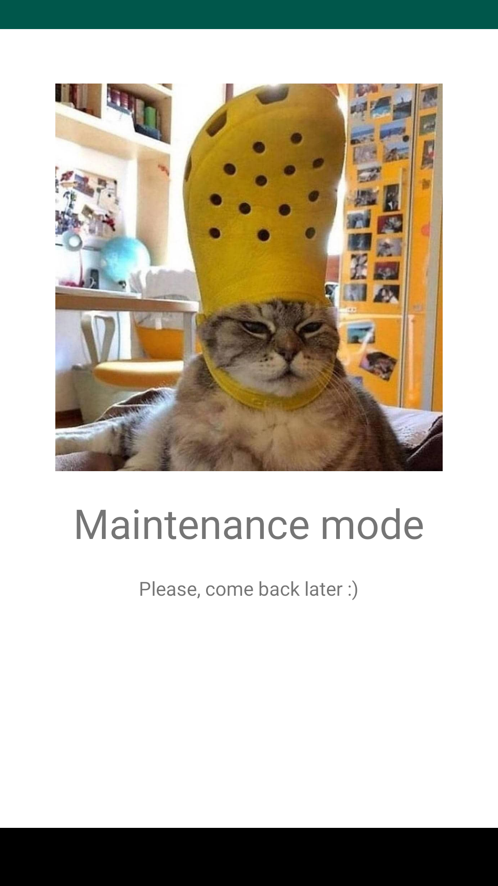
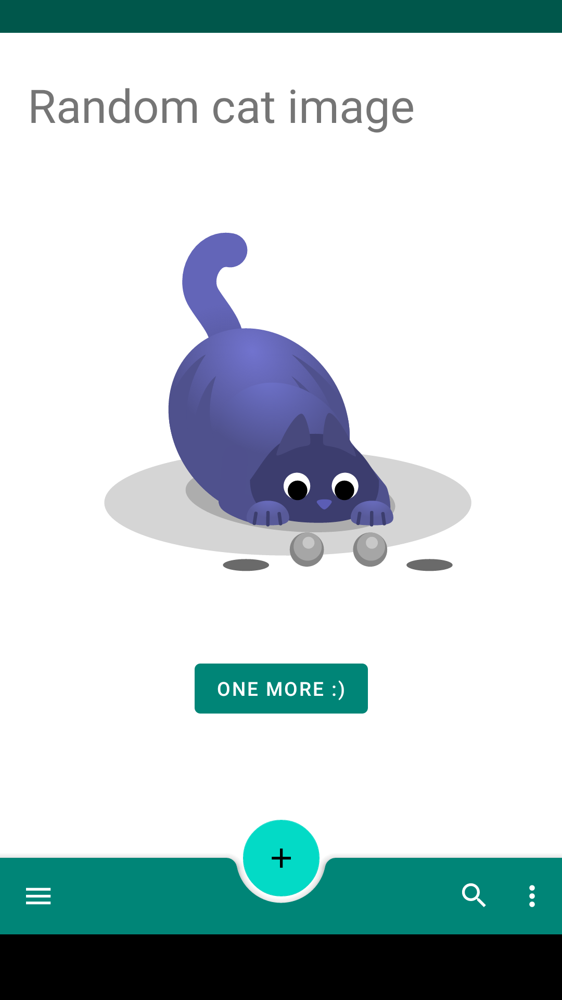

# TheAnimalApp

Multiflavored Android Project, producing two apps at the same time:
- TheCatApp (using [TheCatAPI](https://thecatapi.com/))
- TheDogApp (using [TheDogAPI](https://thecatapi.com/))

Modern Android Development example :smile:

## Architecture
- Clean Architecture
- MVVM
- MVI

## Stack
- Kotlin
- Coroutines
- Architecture Components
    * ViewModel
    * LiveData
    * Navigation Components
- Koin (Dependency Injection)

## Firebase
- Analytics
- Crashlytics
- Remote Config

## Testing
- Unit tests
    * ViewModel and Bussiness logic tests
    * Junit 4 and 5
    * Mockito-Kotlin
    * Google Truth
- UI tests
    * Launching fragments using custom ActivityForTesting
    * Using the newest fragment-testing library [launchFragmentInContainer<SomeFragment>(fragmentArgs)]
    * Espresso
- Screenshot tests
    * Using Screenshot and ScreenCaptureProcessor to capture screenshots
    * Created custom gradle tasks for pulling screenshots from the device

## Screenshots
| Launcher Screen      | Maintenance Screen      | Random Cat Screen      |
|------------|-------------|-------------|
|  |  |  |

# License

    Copyright 2020 Patryk Marciszek-Kosieradzki

    Licensed under the Apache License, Version 2.0 (the "License");

    you may not use this file except in compliance with the License.

    You may obtain a copy of the License at

       http://www.apache.org/licenses/LICENSE-2.0

    Unless required by applicable law or agreed to in writing, software

    distributed under the License is distributed on an "AS IS" BASIS,

    WITHOUT WARRANTIES OR CONDITIONS OF ANY KIND, either express or implied.

    See the License for the specific language governing permissions and

    limitations under the License.
